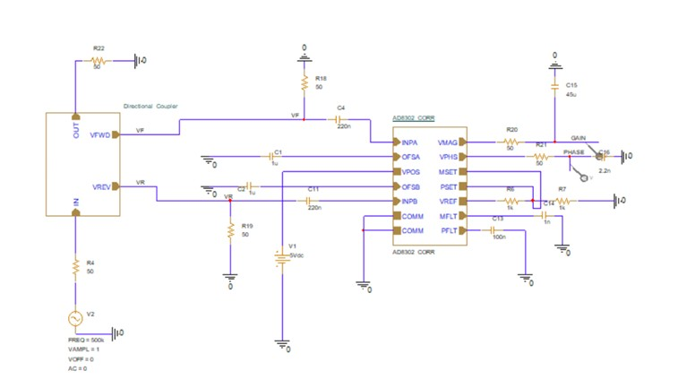
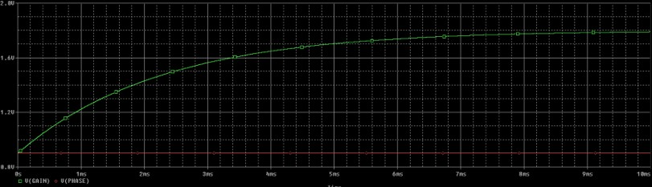
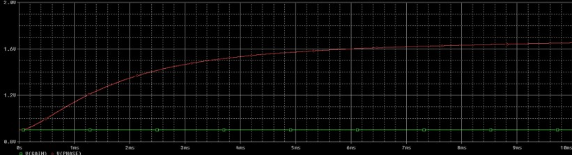
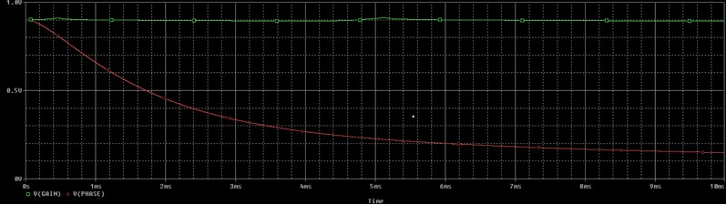

# Wireless Power Transfer in PSpice

## Overview

This project analyzes a Wireless Power Transfer (WPT) system using PSpice simulations.

## Objectives

- Study inductive coupling
- Analyze transfer efficiency
- Observe voltage and current waveforms

## Tools used

- PSpice

## Thesis

The full thesis is available in PDF format.

### Circuit

## Simulation Results

### Matched Load Condition

This simulation shows the behaviour of the system when the load is matched for maximum power transfer.

---

### Open Circuit Condition

Simulation results obtained with the secondary side open-circuited.

---

### Short Circuit Condition

Simulation results obtained with the secondary side short-circuited.

---

## Author

Rino Nazlić
